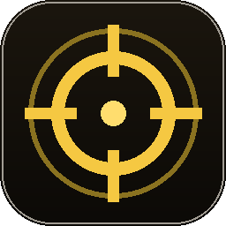

# ClickLater

A small, self-contained Windows desktop utility — *click here … later*.

<p align="center">
  
</p>

## What it does

1. **Keep screen active** — blocks the display from sleeping and the machine from idling.
2. **Click a point** — pick any screen point with a full-screen crosshair, then click it on demand.
3. **Timed click** — click that point automatically after an `HH:MM:SS` countdown.

Modern dark UI (CustomTkinter, gold-on-charcoal). Windows-only — it uses the Win32
API via `ctypes` for cursor control and power-state management, and is fully
per-monitor DPI aware so the point you pick is the point it clicks at 125/150/175% scaling.

## Download

Grab the latest `ClickLater.exe` from the [**Releases**](https://github.com/jrobbertse123/ClickLater/releases/latest)
page. It's a single portable executable — no install, no dependencies. Just run it.

> Windows SmartScreen may warn about an unsigned app from an unknown publisher.
> Click **More info → Run anyway**. The exe is built in the open by GitHub Actions
> from the source in this repo.

## Run from source

```powershell
python -m pip install -r requirements.txt
python click_later.py
```

## Build the exe yourself

```powershell
powershell -ExecutionPolicy Bypass -File .\build.ps1
```

`build.ps1` regenerates the icon, freezes a one-file windowed exe with PyInstaller
(bundling the icon and CustomTkinter's theme assets), and drops it in `.\dist`.
It builds in `%TEMP%` and copies only the finished exe back — important if the
project lives inside a Google Drive / OneDrive synced folder, where the sync
client locks files mid-write and breaks PyInstaller's cleanup.

## Project layout

| File | Purpose |
| --- | --- |
| `click_later.py` | The whole app — UI + Win32 input backend. |
| `make_icon.py` | Generates `click_later.ico` / `.png` (the gold reticle) with Pillow. |
| `build.ps1` | Drive-safe local build script. |
| `ClickLater.spec` | PyInstaller spec used by the release workflow. |
| `.github/workflows/release.yml` | Builds and publishes the exe on every version tag. |

## License

[MIT](LICENSE)
